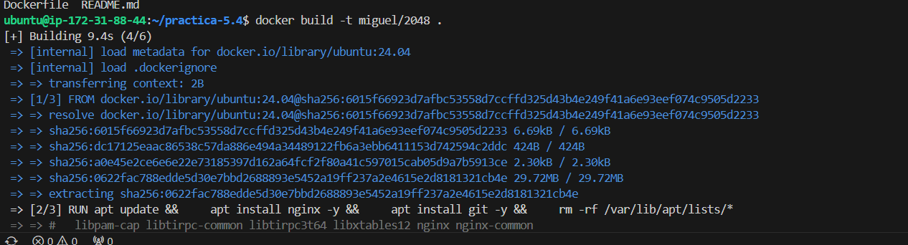
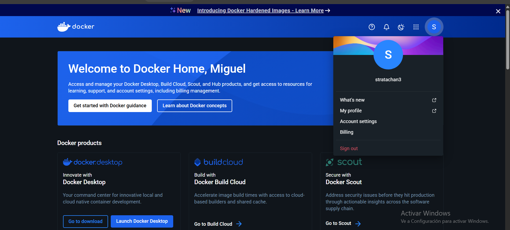
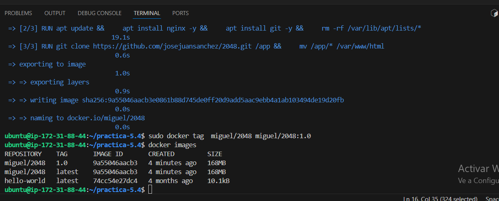
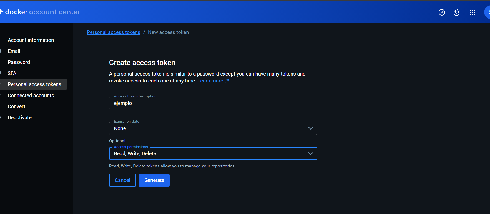
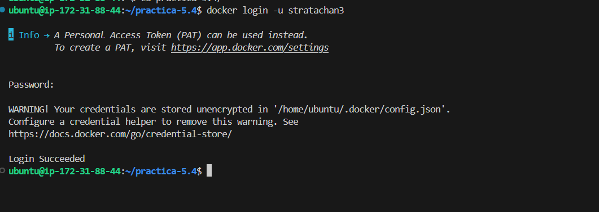
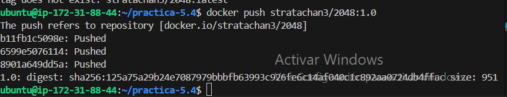
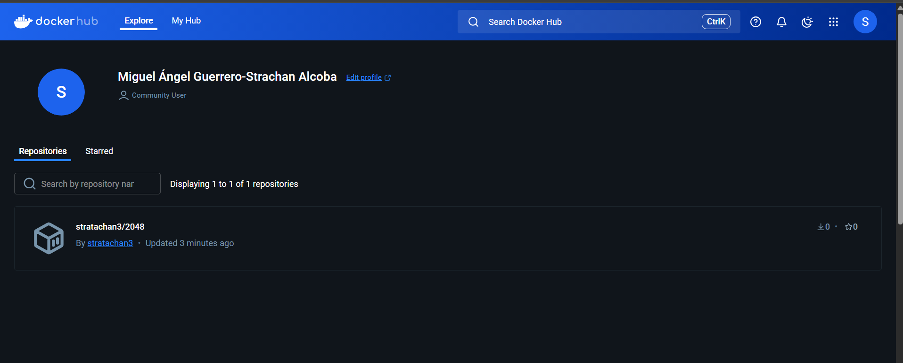
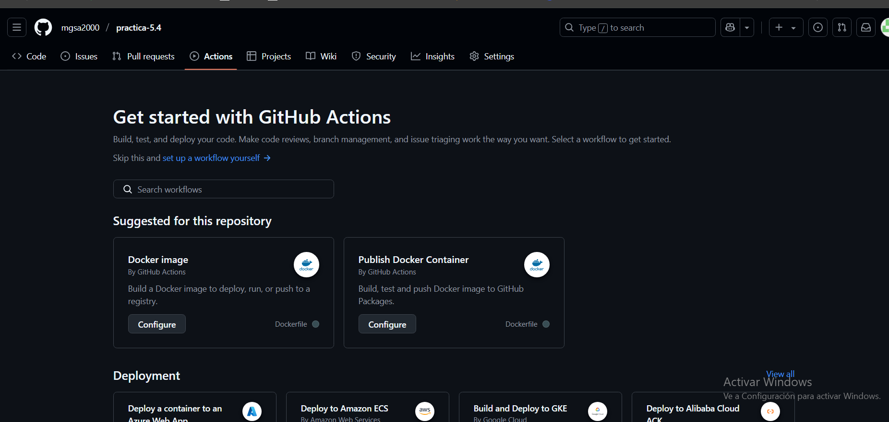
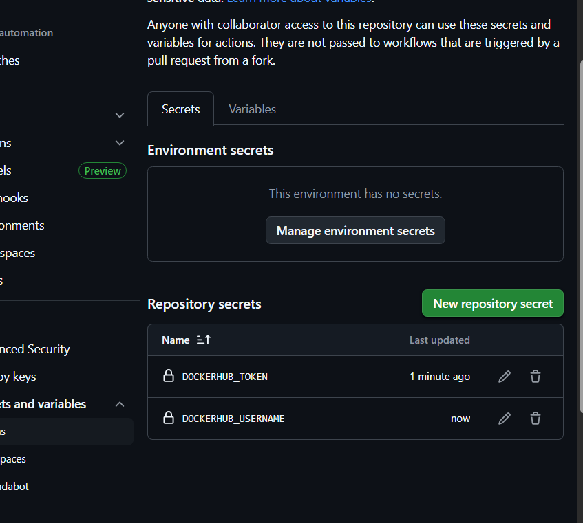
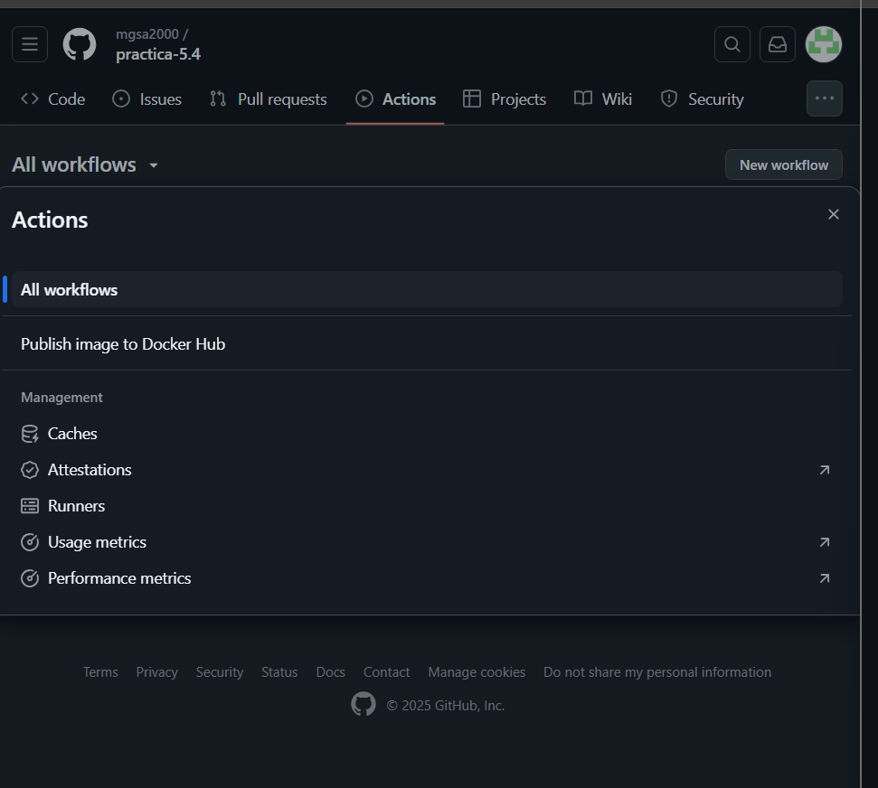

# practica-5.4

El primer paso será crear la imagen usand el comando docker build -t 2048,previamente creando el archivo dockerfile.

Lo siguiente será iniciar sesión en docker hub.

Ahora, con el comando docker tag cambiaremos el nombre de la imagen,para que aparezca con la etiqueta latest y 1.0

El siguiente paso,será publicr la imagen para ello,remos al apartado Account Settings y dentro de este iremos al apartado de personal access tokens Creamos un token y seleccionamos la opción de Access Permissions de Read, Write, Delete para tener todos los permisos disponibles.

ejecutamos en la terminal el comando que nos da docker hub e introducimos la contraseña que nos da

posteiormente,hacemos docker push con el nombre de nuestra imagenn.

Ahora si vamos a docker hub veremos que nuestra imagen ha sido publicada.

Publicar la imagen automaticamente

LO que haremos será entrar en github y en nuestro repositorio pulsaremos sobre Actions y aqui sobre New Workflow

aqui crearemos el siguiente script

´´´´
name: Publish image to Docker Hub

# This workflow uses actions that are not certified by GitHub.
# They are provided by a third-party and are governed by
# separate terms of service, privacy policy, and support
# documentation.

on:
  push:
    branches: [ "main" ]
    # Publish semver tags as releases.
    tags: [ 'v*.*.*' ]
  workflow_dispatch:

env:
  # Use docker.io for Docker Hub if empty
  REGISTRY: docker.io
  # github.repository as <account>/<repo>
  #IMAGE_NAME: ${{ github.repository }}
  IMAGE_NAME: 2048
  IMAGE_TAG: latest

jobs:
  build:

    runs-on: ubuntu-latest
    permissions:
      contents: read
      packages: write

    steps:
      - name: Checkout repository
        uses: actions/checkout@v3

      # Set up BuildKit Docker container builder to be able to build
      # multi-platform images and export cache
      # https://github.com/docker/setup-buildx-action
      - name: Set up Docker Buildx
        uses: docker/setup-buildx-action@f95db51fddba0c2d1ec667646a06c2ce06100226 # v3.0.0

      # Login against a Docker registry except on PR
      # https://github.com/docker/login-action
      - name: Log into registry ${{ env.REGISTRY }}
        uses: docker/login-action@343f7c4344506bcbf9b4de18042ae17996df046d # v3.0.0
        with:
          registry: ${{ env.REGISTRY }}
          username: ${{ secrets.DOCKERHUB_USERNAME }}
          password: ${{ secrets.DOCKERHUB_TOKEN }}

      # This action can be used to check the content of the variables
      - name: Debug
        run: |
          echo "github.repository: ${{ github.repository }}"
          echo "env.REGISTRY: ${{ env.REGISTRY }}"
          echo "github.sha: ${{ github.sha }}"
          echo "env.IMAGE_NAME: ${{ env.IMAGE_NAME }}"

      # Build and push Docker image with Buildx (don't push on PR)
      # https://github.com/docker/build-push-action
      - name: Build and push Docker image
        id: build-and-push
        uses: docker/build-push-action@0565240e2d4ab88bba5387d719585280857ece09 # v5.0.0
        with:
          context: .
          push: ${{ github.event_name != 'pull_request' }}
          tags: ${{ env.REGISTRY }}/${{ secrets.DOCKERHUB_USERNAME }}/${{ env.IMAGE_NAME }}:${{ env.IMAGE_TAG }}
          cache-from: type=gha
          cache-to: type=gha,mode=max          
  ´´´´

          en el script hay dos variables que tendran que definirse en el apartado secret.

          Para ello entramos en Settings del repositorio, dentro de Security entraremos en Secrets and variables y aqui en Actions, aqui tendremos que definir las variables. En DOCKERHUB_TOKEN pondremos la conmtraseña del token de Docker Hub y en DOCKERHUB_USERNAME pondremos nuestro nombre de usuario de Docker Hub.

          

    entramos en Actions seleccionamos nuestro Publish image to Docker Hub y pulsamos el botón de Run Workflow

    
          
ejecutamos la aplicacion web con el siguiente comando:

docker run -d --name webserver --rm -p 80:80 stratachan3/2048
